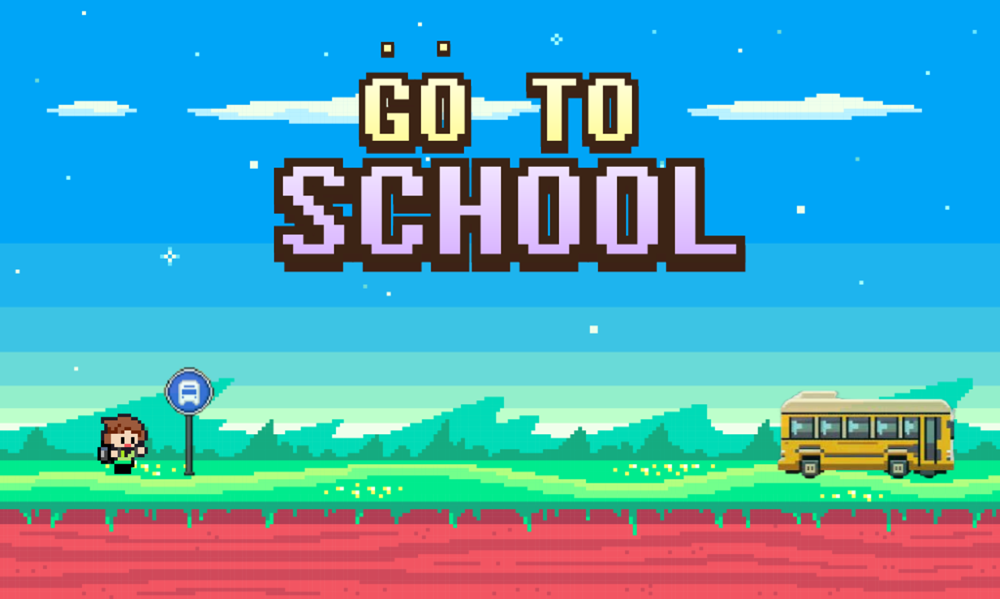

# GO TO SCHOOL!

<p align="center">
  
</p>

<p align="center">
  별을 모으며 장애물을 피하고 학교에 도착하는 2D 플랫폼 게임
</p>

## 프로젝트 소개

**GO TO SCHOOL**은 강남대학교 셔틀 버스 달구지를 놓친 신입생 **강냉이**의 등굣길을 그린 Pygame 기반의 2D 플랫폼 게임입니다.

플레이어는 총 4개의 일반 스테이지를 지나 최종 보스와 대결합니다. 각 스테이지에 배치된 별을 모으고 불, 유령, 빗물, 연못, 로켓 등의 장애물을 피해 출구에 도착해야 합니다. 최종 보스를 처치하면 수집한 별의 개수에 따라 등급이 결정됩니다.

## 주요 기능

- 좌우 이동과 점프를 이용한 플랫폼 액션
- 스테이지마다 달라지는 지형과 장애물
- 별 수집 및 피격 시 별 차감 시스템
- 일반 스테이지 4개와 최종 보스전 구성
- 배경 음악과 점프·피격·수집·공격 효과음
- 최종 별 개수를 반영한 등급 평가

## 게임 구성

| 구간 | 주요 요소 | 획득 가능한 별 |
| --- | --- | ---: |
| Stage 1 | 발판 이동, 불 장애물 | 5개 |
| Stage 2 | 계단형 지형, 움직이는 유령, 낙하하는 빗물 | 3개 |
| Stage 3 | 다양한 높이의 발판, 연못, 함정 발판 | 4개 |
| Stage 4 | 지면을 따라 날아오는 로켓 | 2개 |
| Final Stage | 유령과 버스 공격을 피하며 체력 40의 보스 공략 | 이전 스테이지 점수 유지 |

장애물이나 보스의 공격에 맞으면 보유한 별이 1개 차감될 수 있습니다. 일반 스테이지에서 모을 수 있는 별은 최대 14개입니다.

## 조작 방법

| 입력 | 동작 |
| --- | --- |
| `←` / `→` | 캐릭터 좌우 이동 |
| `Space` | 점프 |
| `Z` | 총알 발사 (최종 보스전) |

## 최종 등급

| 최종 별 개수 | 등급 |
| ---: | :---: |
| 11개 이상 | A+ |
| 5~10개 | B+ |
| 1~4개 | C+ |
| 0개 | F |

## 기술 스택

- Python 3
- Pygame
- PNG 이미지 에셋
- MP3·WAV 오디오 에셋

## 실행 방법

### 1. 저장소 복제

```bash
git clone https://github.com/poak79/Team-4days.git
cd Team-4days
```

### 2. 가상 환경 생성 및 활성화

Windows PowerShell:

```powershell
py -m venv .venv
.\.venv\Scripts\Activate.ps1
```

macOS / Linux:

```bash
python3 -m venv .venv
source .venv/bin/activate
```

### 3. Pygame 설치

```bash
python -m pip install pygame
```

### 4. 게임 실행

```bash
python startPyGame.py
```

모든 이미지와 음원은 상대 경로로 불러오므로 반드시 프로젝트 최상위 디렉터리에서 실행해야 합니다.

## 프로젝트 구조

```text
Team-4days/
├── startPyGame.py         # 게임 실행 및 전체 스테이지 연결
├── main_lobby.py          # 시작·게임 안내·종료 메뉴
├── stage1_sw_fg.py        # Stage 1: 불 장애물
├── stage2_fg_sh.py        # Stage 2: 유령과 빗물
├── stage3_sh_li.py        # Stage 3: 발판과 연못
├── stage4_Li_ee.py        # Stage 4: 로켓
├── stageFinal_BOSS.py     # 최종 보스전
├── show_final_result.py   # 최종 점수 및 등급 화면
├── DungGeunMo.ttf         # 결과 화면 글꼴
├── *.png                  # 캐릭터·배경·발판·장애물 이미지
├── *.mp3                  # 배경 음악
└── *.wav                  # 게임 효과음
```

## 실행 시 참고 사항

Linux처럼 파일명의 대소문자를 구분하는 운영체제에서는 코드의 캐릭터 이미지 이름을 실제 파일명과 동일하게 수정해야 합니다.

| 코드에서 사용하는 이름 | 실제 파일명 |
| --- | --- |
| `KNU_Student.PNG` | `KNU_Student.png` |
| `KNU_Student_right.PNG` | `KNU_student_right.png` |
| `KNU_Student_left.PNG` | `KNU_student_left.png` |

## 게임 흐름

```text
메인 로비 → Stage 1 → Stage 2 → Stage 3 → Stage 4 → 최종 보스전 → 등급 확인 → 메인 로비
```

각 스테이지의 문에 도착하면 다음 스테이지로 이동합니다. 최종 보스전에서는 보스를 처치한 뒤 생성되는 문에 도착해야 게임이 종료되고 결과가 표시됩니다.

